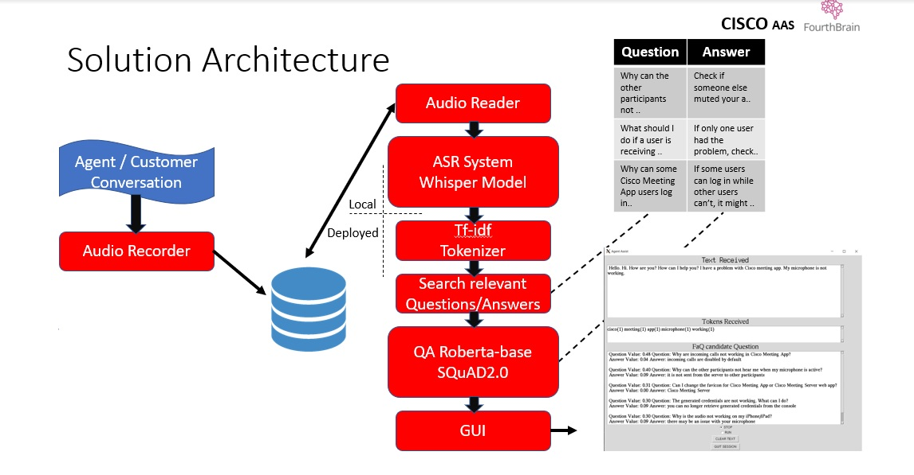
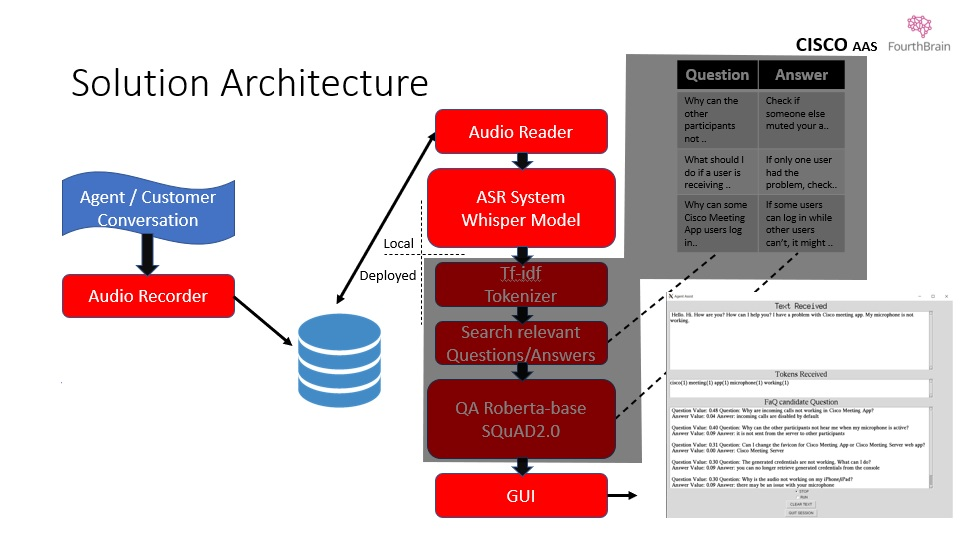

# AgentAssist-speech   (local)

AgentAssist Solution is a POC about:

**Helping Organizations achieve a higher level of customer satisfaction**

The Agent Assist Solution provides on the spot technical knowledge related to a conversation that is taking place.
The Customer–Agent dialogue usually starts with greetings and salutations, followed by an optional customer identification and then the actual query.
The assistant listen to the entire conversation, filter the irrelevant content, and presents the pertinent results on the Agent screen, along with confidence scores of each individual result.

## System Architecture
  


### System components     *(this solution comprises two repos)*
Local deployment: Audio Recorder, Audio Reader, ASR System, GUI

Remote deployment: tf-idf Tokenizer, Search engine, RoBERTa for Question Answering

### How it works

The input stage is an audio recorder module that continuously records on local storage the conversation that is taking place.
At the same time, the local ‘Whisper’ model retrieves the audio files and transcribes them,  generating a text with the full content of the conversation.
The full text is fed to a tf-idf tokenizer. Then, the tokens are compared with the FAQ questions tokens using dot product similarity.
The dot product results are ordered by the score value, returning the five most relevant question/answer pairs from the FAQ table.
The Question–Answer Roberta model digests the question and the answer as the context and returns a short answer along with its confidence score.

### AgentAssist-speech (local) is the local part, please check:

### AgentAssist https://github.com/MitchCosta/AgentAssist for the deployed part

###

## System Architecture - This Repo
  


This entire project was developed on WSL2. But there is a problem, WSL2 doesn't support audio and video.
To bypass the situation the audio recorder should run in the Windows environment, also an X-server must be used to support the GUI.

### Audio Recorder

We recommend to run the audio recorder in CMD (in a different terminal) rather than an IDE to save computer resources.

In Windowns:

```
Create a Python virtual environment

Activate the environment

Install PyAudio

Copy file pyaudio-speech-recorder.py to a folder of your choice

Edit line 137 and change the path to store the audio files (must be the same path of the Audio Reader)
```

### X-Server (GUI)

Install X-Server  https://sourceforge.net/projects/vcxsrv/

Launch xlaunch.exe from folder (usualy:  Program Files/VcXsrv)

Everything default except 'Disable access control' enable this one

After this you should have access to a display from WSL2, run folowing commands to export and check:

```
export DISPLAY=$(grep nameserver /etc/resolv.conf | awk '{print $2}'):0.0
echo $DISPLAY
```

After the second command, should be displayed the string '172.21.16.1:0.0' (last number 0 or 1 depending on your system)

Good to go, X-server is installed


### ASR System / Whisper model

Create and activate a virtual environment, use conda or venv

```
conda create --name my_env python=3.8
conda activate my_env

```
Install the required packages

```
pip install -r requirements.txt
```

In audio-transcriber.py edit line 288 and change the IP Address to the IP of the deployed container or 0.0.0.0 if running locally.

### Install Whisper

Follow the instructions in:

```
https://github.com/openai/whisper
```

Run audio-transcriber.py

```
python audio-transcriber.py
```

And don't forget to run in a separate window:

```
python pyaudio-speech-recorder.py
```